# Laboratorium 1
Aby odtworzyć rezultaty:
**Windows**
```powershell
python3 -m venv ./venv
```
```powershell
./venv/Scripts/activate
```
```powershell
pip install -r requirements.txt
```
**Linux**
```bash
python3 -m venv ./venv
```
```bash
source ./venv/bin/activate
```
```bash
pip install -r requirements.txt
```
## Zadanie 1
```sh
python ./lab1_task1.py
```
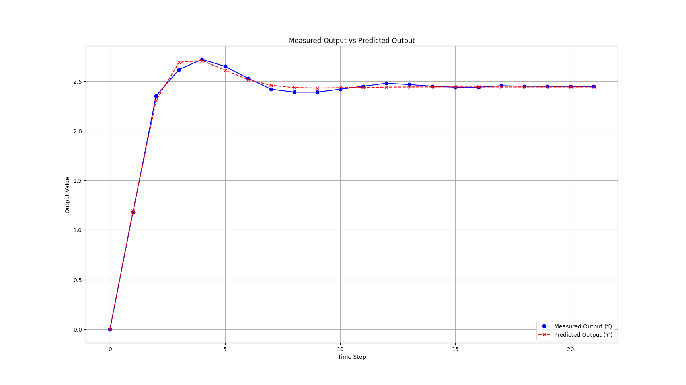

## Zadanie 2
```sh
python ./lab1_task2.py
```
Neuron osiąga prawie arbitralnie niski błąd odwzorowania dla dwóch par danych, natomiast dla trzech zdaje się asymptotycznie zbiegać do błędu MSE około 0.025.

## Zadanie 3
```sh
python ./lab1_task3.py
```
Sieć jest w stanie odseparować podzbiory już od 2 neuronów w warstwie ukrytej, jednak nie każda próba daje odpowiednie rezultaty. Punktami na wykresach pokazane są dane treningowe, barwy tła reprezentują odpowiedź sieci na punkty na płaszczyźnie.

**Bez warstwy ukrytej**

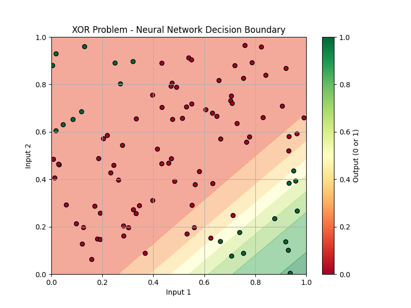

**Dla 2 neuronów**

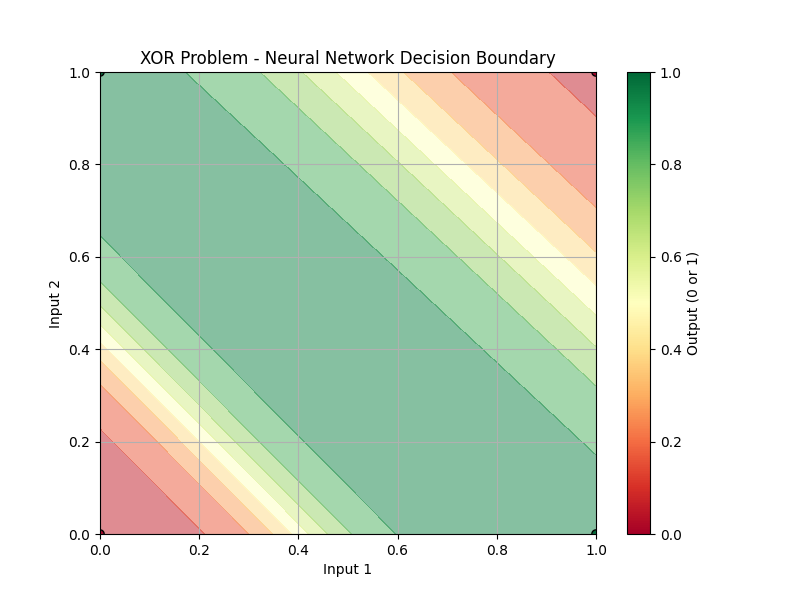

**Dla 9 neuronów**

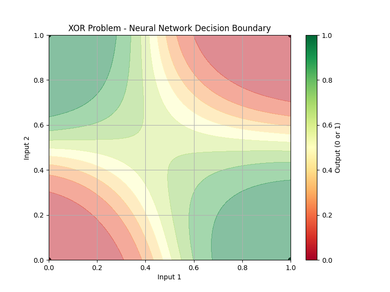


# Laboratorium 2

## Zadanie 1
```sh
python ./lab2_task1.py
```
**Typical**
```python
a = 0.02
b = 0.2
c = -65
d = 2.0
```
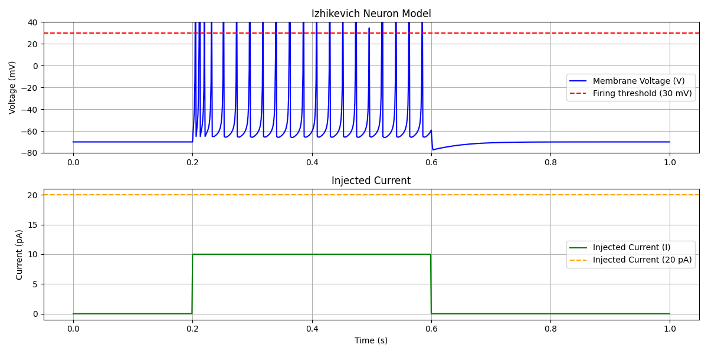

**Bursting**
```python
a = 0.02
b = 0.2
c = -55.
d = 4.0
```
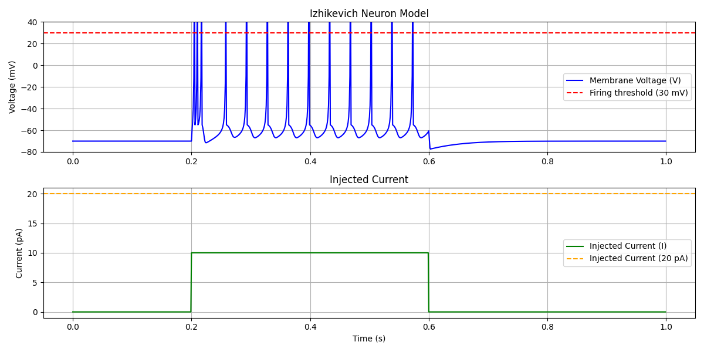

**Chattering**
```python
a = 0.02
b = 0.2
c = -50.
d = 2.0
```
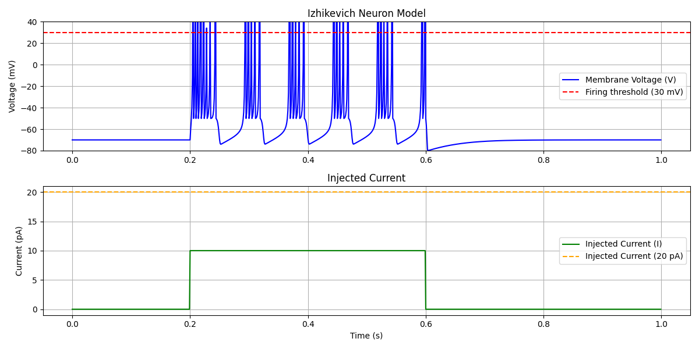

**Regular spiking**
```python
a = 0.02
b = 0.2
c = -65.
d = 8.0
```
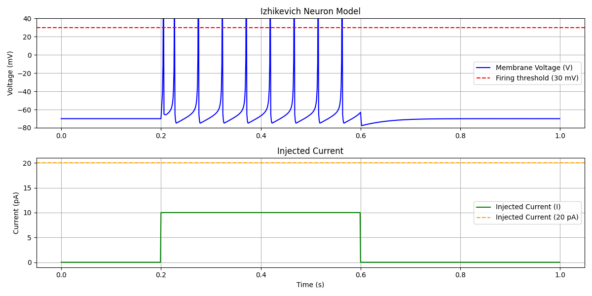

**Dopasowany do wykresu z instrukcji**
```python
a = 0.01
b = 0.2
c = -65.
d = 8.0
```
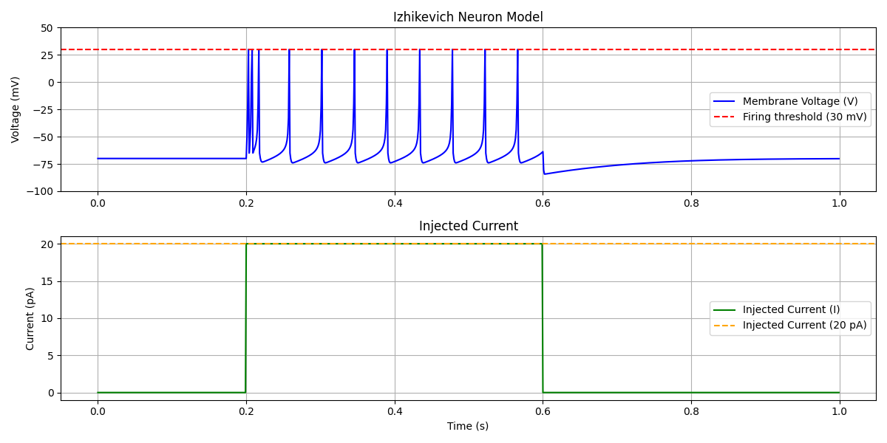

## Zadanie 1 - charakterystyka ilości impulsów od prądu wymuszenia

```sh
python ./lab2_task1_analysis.py
```
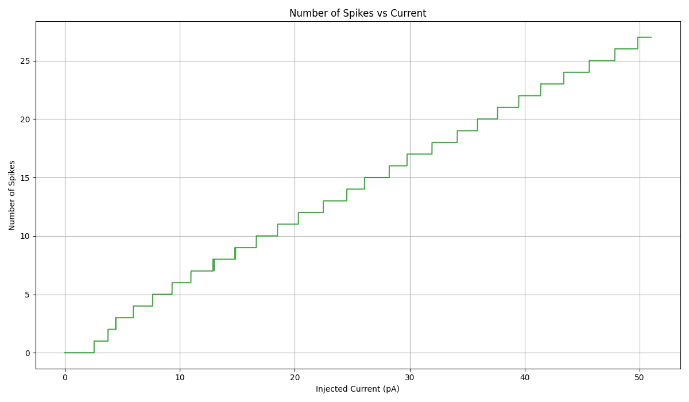

## Zadanie 2
```sh
python ./lab2_task2.py
```

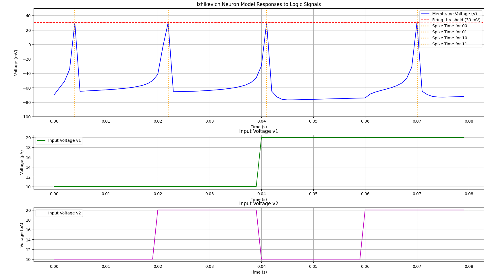

```
Output delays after initial simulation: {'00': 0.003, '01': 0.006, '10': 0.006, '11': 0.004}
Output delays after optimization: {'00': 0.004, '01': 0.002, '10': 0.001, '11': 0.01}
```

Rezultat da się już odseparować liniowo

# Laboratorium 3

## Zadanie 1
Rezultaty dla przykładowych typów neuronów wraz z paramatrami zrealizowałem już w trakcie laboratorium 2 zadania 1.

## Zadanie 2
**Rezultaty dla pobudzonych falą trójkątną neuronów**
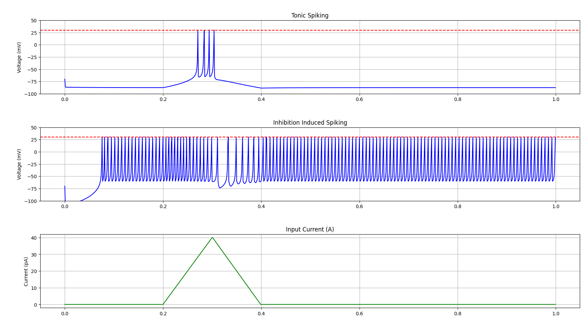

**Częściowa implementacja klasyfikatora**
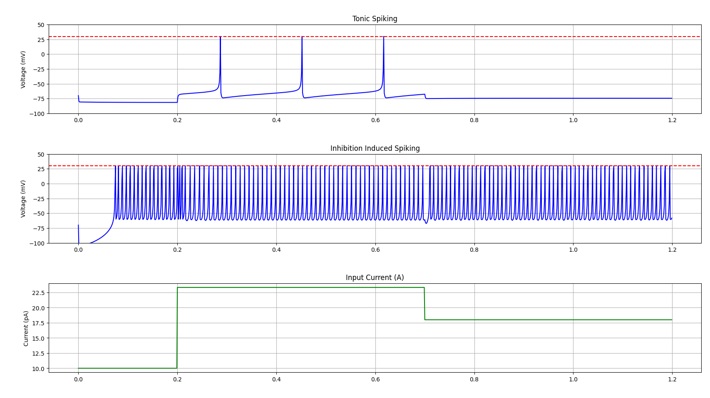

Zaimplementowałem kodowanie wektorów ważąc każdy element kolejnymi potęgami dwójki i skalując do zakresu 0-40 \[pA\].
Niestety nie udało mi się zaimplementować całego klasyfikatora, ponieważ nie wiedziałem jak się za to zabrać. Widać, że neuron typu Tonic Spiking zwraca w miarę równomiernie oddalone powtarzające się impulsy o częstotliwości zależnej od prądu wymuszenia. Neuron Inhibition-Induced Spiking zdaje się reagować na ujemny gradient prądu wymuszenia. 

Niestety nie wiem jak połączyć te neurony, skąd odczytać napięcia oraz w którym miejscu umieścić wagi i biasy.